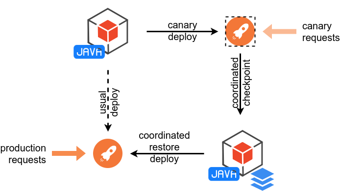

# CRaC

Coordinated Restore at Checkpoint is an OpenJDK feature that provides a fast start and immediate performance for Java applications.

A Java application and JVM are started from an image in a warmed-up form.
The image is created from a running Java instance at arbitrary point of time ("checkpoint").
The start from the image ("restore") continues from the point when checkpoint was made.

The restore in general is faster than initialization.
After the restore, Java runtime performance is also on-par with the one at the checkpoint.
So, after proper warm-up before the checkpoint, restored Java instance is able to deliver the best runtime characteristics immediately.

Coordinated Restore undisruptively introduces new before-checkpoint and after-restore phases in Java application lifecycle.
In contrast with uncoordinated checkpoint/restore, coordination allows restored Java applications to behave differently.
For example, it is possible to react on changes in execution environment that happened since checkpoint was done.

CRaC implementation creates the checkpoint only if the whole Java instance state can be stored in the image.
Resources like open files or sockets are cannot, so it is required to release them when checkpoint is made.
CRaC emits notifications for an application to prepare for the checkpoint and return to operating state after restore.

With more Java frameworks and libraries adopting CRaC, applications can benefit with little or no changes in the code.
Moreover, the required amount of changes in the resource management code tends to be small, see examples below.

Coordinated Restore is not tied to a particular checkpoint/restore implementation and will able to use existing ones (CRIU, docker checkpoint/restore) and ones yet to be developed.

* [Results](#results)
* [JDK](#jdk)
* [Projects with CRaC support](#projects-with-crac-support)
  * [Micronaut](#micronaut)
  * [Quarkus](#quarkus)
* [Proof-of-Concept CRaC support implementation](#proof-of-concept-crac-support-implementation)
  * [Tomcat / Spring Boot](#tomcat--spring-boot)
  * [AWS Lambda](#aws-lambda)
* [User's flow](#users-flow)
* [Programmer's flow](#programmers-flow)
  * [API](#api)
    * [`jdk.crac`](#jdkcrac)
    * [`org.crac`](#orgcrac)
* [Implemenation details](#implemenation-details)

## Results

CRaC support was implemented in a few frameworks with next results.
The source code can be found in the [Examples](#examples) section.

<details><summary>The environment</summary>
<p>

* laptop with Intel i7-5500U, 16Gb RAM and SSD.
* Linux kernel 5.7.4-arch1-1
* data was collected in container running `ubuntu:18.04` based image
* host operating system: archlinux

[jdk14-crac build](https://github.com/org-crac/jdk/releases/tag/release-jdk-crac)

---
</p>
</details>

<details><summary>How to reproduce</summary>
<p>

To reproduce you need to create a workspace directory and clone along next repositories:
* [utils](https://github.com/org-crac/utils)
* [docs](https://github.com/org-crac/docs) (this repo)
* [example-spring-boot](https://github.com/org-crac/example-spring-boot)
* [example-quarkus](https://github.com/org-crac/example-quarkus)
* [example-micronaut](https://github.com/org-crac/example-micronaut)
* [example-xml-transform](https://github.com/org-crac/example-xml-transform)

You need to build examples according [Examples](#examples) section.

Then run
```
host$ docker build -t full-bench -f Dockerfile.full-bench utils
host$ docker run -it --privileged -v $HOME:$HOME -v $PWD:$PWD -w $PWD full-bench
cont# JDK=<path/to/jdk> bash ./utils/full-bench.sh collect
...
cont# exit
host$ bash ./utils/full-bench.sh parse
host$ cp *.data docs
host$ make -C docs
```
Last command regenerates graphs in the `docs`.

---
</details>


## JDK

OpenJDK CRaC Project is developed in https://github.com/openjdk/crac.

Latest release can be found in https://crac.github.io/openjdk-builds.

```
$ sudo tar zxf <jdk>.tar.gz
```

**NOTE**: The JDK archive should be extracted with `sudo`.

## Projects with CRaC support

### Micronaut

You can just add `crac` feature at https://micronaut.io/launch!

* [Micronaut CRaC Module](https://micronaut-projects.github.io/micronaut-crac/latest/guide)
  * Hikari DataSources coordination
  * Redis coordintation
* [Build System](https://micronaut-projects.github.io/micronaut-gradle-plugin/latest/#_micronaut_crac_plugin)
  * a single command to generate a docker image with CRaC image included

Example: https://github.com/CRaC/example-micronaut

### Quarkus

Basic CRaC support is a part of Quarkus [since 2.10.0](https://github.com/quarkusio/quarkus/pull/23950).

Example: https://github.com/CRaC/example-quarkus

## Proof-of-Concept CRaC support implementation

Proof-of concept CRaC support was implemented in a few third-party frameworks and libraries.

Source code links are below.
Builds can be found in [Maven Central](https://mvnrepository.com/artifact/io.github.crac) under `io.github.crac` artifact-id.

### Tomcat / Spring Boot

[Tomcat with CRaC](https://github.com/CRaC/tomcat) is modification of Tomcat with CRaC support and it enables CRaC for Spring Boot applications.

Artifacts: https://mvnrepository.com/artifact/io.github.crac.org.apache

Example: https://github.com/CRaC/example-spring-boot ([diff](https://github.com/CRaC/example-spring-boot/compare/base..crac))

Changes: https://github.com/CRaC/tomcat/compare/8.5.75..crac
* Tomcat Embed (used by spring-boot-example below):
  * `java/org/apache/tomcat/util/net/AbstractEndpoint.java`
  * `res/maven/tomcat-embed-core.pom`
* JDBC Pool library:
  * `modules/jdbc-pool/`
* standalone Tomcat (Catalina):
  * `java/org/apache/catalina/`
  * `java/org/apache/juli/`
  * `bin/`, `conf/`

### AWS Lambda

[AWS Libs with CRaC](https://github.com/CRaC/aws-lambda-java-libs) allows implementation of AWS Lambda functions on CRaC JDK.

Artifacts: https://mvnrepository.com/artifact/io.github.crac.com.amazonaws

Example: https://github.com/crac/example-lambda ([diff](https://github.com/crac/example-lambda/compare/0182484592feed..master)) is a sample Java serverless function on CRaC.

Changes: https://github.com/CRaC/aws-lambda-java-libs/compare/master...crac

## User's flow
<!--
CRaC allows to start Java applications that are alreay initialized and warmed-up.
Deployment scheme reflects the need to collect the required data.
-->

CRaC deployment scheme reflects the need to collect data required for Java application initialization and warm-up.



1. a Java application (or container) is deployed in the canary environment
    * the app processes canary requests that triggers class loading and JIT compilation
2. the running application is checkpointed by some mean
    * this creates the image of the JVM and application; the image is considered as a part of a new deployment bundle
3. the Java application with the image are deployed in the production environment
    * the restored Java process uses loaded classes from and JIT code from the immediately

**WARNING**: next is a proposal phase and is subject to change

Please refer to [examples](#examples) sections, [step-by-step guide](STEP-BY-STEP.md) or [best practices guide](best-practices.md) to get an application with CRaC support.
The rest of the section is written for the [spring-boot example](#tomcat--spring-boot).

For the first, Java command line parameter `-XX:CRaCCheckpointTo=PATH` defines a path to store the image and also allows the java instance to be checkpointed.
By the current implementation, the image is a directory with image files.
The directory will be created if it does not exist, but no parent directories are created.

```
export JAVA_HOME=./jdk
$JAVA_HOME/bin/java -XX:CRaCCheckpointTo=cr -jar target/spring-boot-0.0.1-SNAPSHOT.jar
```

For the second, in another console: supply canary worload ...
```
$ curl localhost:8080
Greetings from Spring Boot!
```
... and make a checkpoint by a jcmd command
```
$ jcmd target/spring-boot-0.0.1-SNAPSHOT.jar JDK.checkpoint
1563568:
Command executed successfully
```
Due to current jcmd implementation, success is always reported in jcmd output, problems are reported in the console of the application.

Another option to make the checkpoint is to invoke the `jdk.crac.Core.checkpointRestore()` method (see [API](#api)).
More options are possible in the future.

For the third, restore the `cr` image by `-XX:CRaCRestoreFrom=PATH` option

```
$JAVA_HOME/bin/java -XX:CRaCRestoreFrom=cr
```

## Programmer's flow

Programs may need to be adjusted for use with Coordinated Restore at Checkpoint.

A [step-by-step guide](STEP-BY-STEP.md) and [best practices guide](best-practices.md) provide information on how to implement the CRaC support in the code.

Another option is to use an existing framework with CRaC support.

No changes required:
* Micronaut: https://github.com/CRaC/example-micronaut
* Quarkus: https://github.com/CRaC/example-quarkus

With configuration changes:
* Spring-boot/Tomcat: https://github.com/CRaC/example-spring-boot/compare/base..crac


### API

The CRaC API is not a part of Java SE specification.
We hope that eventually it will be there, until then there are different packages that can be used.

#### `jdk.crac`

* [javadoc](https://crac.github.io/jdk/jdk-crac/api/java.base/jdk/crac/package-summary.html)

This is the API that is implemented in the [CRaC JDK](#JDK).

Please refer to [`org.crac`](#orgcrac) if you are looking to add CRaC support to a code that should also work on a regular JDK/JRE.

#### `org.crac`

The package is provided by [org.crac](https://github.com/org-crac/org.crac) compatibility library.

The org.crac is designed to provide smooth CRaC adoption.
Users of the library can build against and use CRaC API on Java runtimes with `jdk.crac`, `javax.crac`, or without any implementation.
* In compile-time, `org.crac` package totally mirrors `jdk.crac` and `javax.crac`.
* In runtime, org.crac uses reflection to detect CRaC implementation.
If the one is available, all requests to `org.crac` are passed to the implementation.
Otherwise, requests are forwarded to a dummy implementation.

The dummy implementation allows an application to run but not to use CRaC:
* resources can be registered for notification,
* checkpoint request fails with an exception.


## Implemenation details

Current OpenJDK implementation is based on using the CRIU project to create the image.

[CRIU](https://github.com/CRaC/criu) hosts a few changes made to improve CRaC usability.

You can read more about debugging C/R issues in your application in the [debug guide](./debugging.md).
