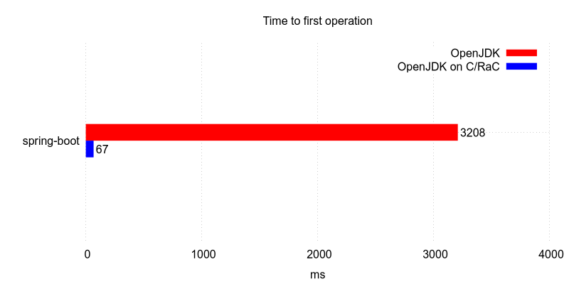
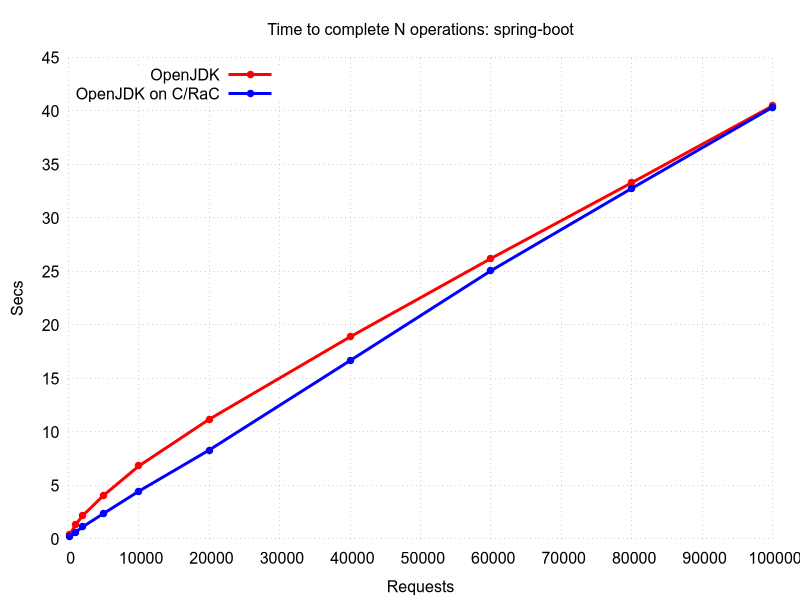
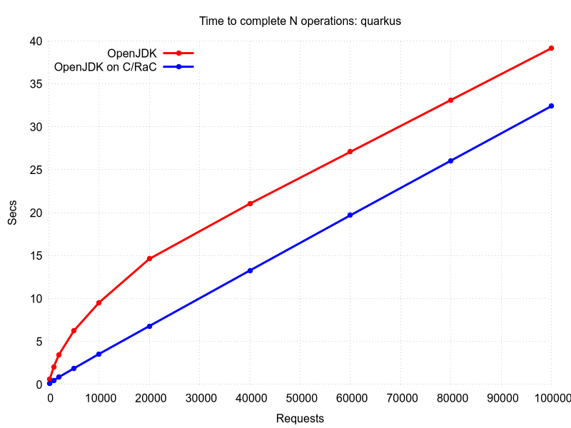
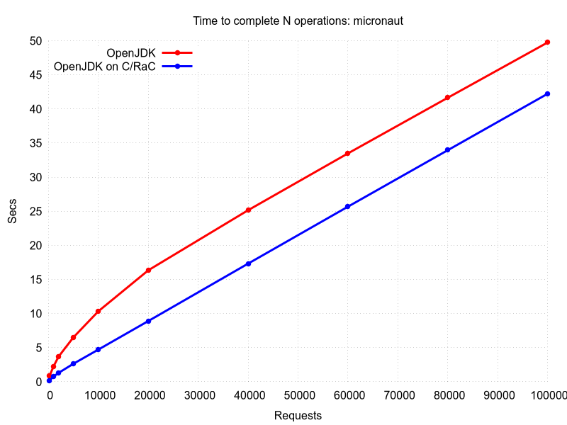
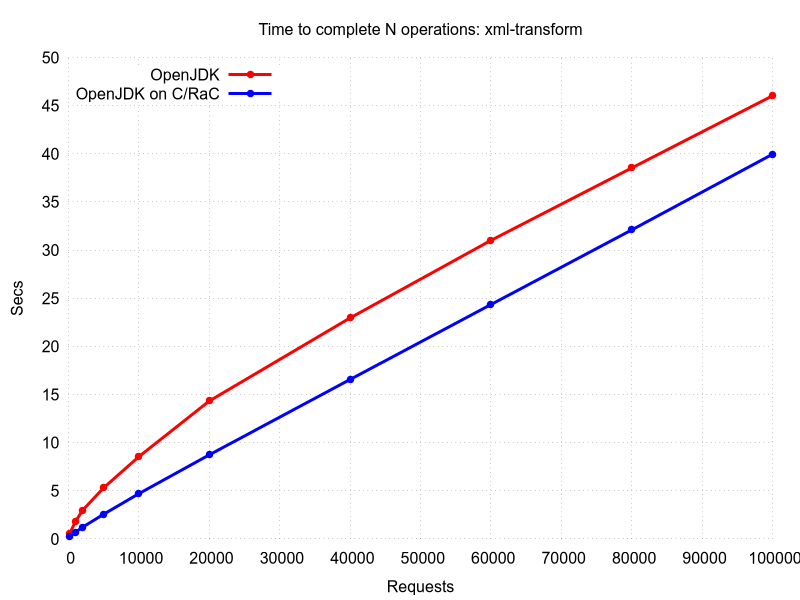

# CRaC

Coordinated Restore at Checkpoint is an OpenJDK feature that provides a fast start and immediate performance for Java applications.

A Java application and JVM are started from an image in a warmed-up form.
The image is created from a running Java instance at arbitrary point of time ("checkpoint").
The start from the image ("restore") continues from the point when checkpoint was made.

CRaC implementation creates checkpoint only if the whole Java instance state can be stored in the image.
Resources like open files or sockets are cannot, so it is required to release them when checkpoint is made.
CRaC emits notifications for an application to prepare for the checkpoint and return to operating state after restore.

* [Results](#results)
* [Builds](#builds)
* [Examples](#examples)
  * [Jetty tutorial](#jetty-tutorial)
  * [Tomcat / Sprint Boot](#tomcat--sprint-boot)
  * [Quarkus](#quarkus)
  * [Micronaut](#micronaut)
* [API](#api)
  * [org.crac](#orgcrac)
* [Implemenation details](#implemenation-details)

## Results

CRaC support was implemented in a few frameworks and it provides next results.
Source code for changes and examples can be found in the [Examples](#examples).











## Builds

[JDK](https://github.com/org-crac/jdk) provides a proof-of-concept CRaC API implementation for Linux as well as prebuilt [binaries](https://github.com/org-crac/jdk/releases/tag/release-jdk-crac).

The archive should be extracted with
```
$ sudo tar zxf jdk.tar.gz
````

## Examples

Examples are started with Jetty tutorial, followed by a few third-party frameworks and libraries, which demonstrates how CRaC support can be implemented.

CRaC support in a framework allows small if any modification to applications using it.

### Jetty tutorial

Application may need to be changed to run with CRaC.
This section reviews all steps needed to use CRaC with a Jetty application.

Full source code for this section can be found in [example-jetty](https://github.com/org-crac/example-jetty) repo.
Commit history corresponds to the steps of the tutorial with greater details.

Let's take a simple Jetty application as a starting point:
```java
class ServerManager {
    Server server;

    public ServerManager(int port, Handler handler) throws Exception {
        server = new Server(8080);
        server.setHandler(handler);
        server.start();
    }
}

public class App extends AbstractHandler
{
    static ServerManager serverManager;

    public void handle(...) {
        response.getWriter().println("Hello World");
    }

    public static void main(String[] args) throws Exception {
        serverManager = new ServerManager(8080, new App());
    }
}
```

The main thread creates an instance of `ServerManager` that starts managing a jetty instance.
The thread then exits, leaving the jetty instance a single non-daemon thread.

Java with CRaC needs to be configured in runtime.
Java argument `-Zcheckpoint:PATH` defines a path to store the image.
By current implementation it is a directory that will be created if doesn't exist and filled with image files.
```sh
$ mvn package
$ $JAVA_HOME/bin/java -Zcheckpoint:cr -jar target/example-jetty-1.0-SNAPSHOT.jar
2020-06-29 18:01:32.944:INFO::main: Logging initialized @293ms to org.eclipse.jetty.util.log.StdErrLog
2020-06-29 18:01:33.003:INFO:oejs.Server:main: jetty-9.4.30.v20200611; built: 2020-06-11T12:34:51.929Z; git: 271836e4c1f4612f12b7bb13ef5a92a927634b0d; jvm 14-internal+0-adhoc..jdk
2020-06-29 18:01:33.045:INFO:oejs.AbstractConnector:main: Started ServerConnector@319b92f3{HTTP/1.1, (http/1.1)}{0.0.0.0:8080}
2020-06-29 18:01:33.047:INFO:oejs.Server:main: Started @406ms
```

This instance works as usual and can handle a desired workload that will warm-up
the application and the JVM:
```
$ curl localhost:8080
Hello World
```

After warm-up completed, the checkpoint can be requrested via an API call or via `jcmd` command (more ways may be possible in the future).
We can try to use `jcmd` now:

```
$ jcmd target/example-jetty-1.0-SNAPSHOT.jar JDK.checkpoint
80694:
Command executed successfully
```
Due to jcmd implementation, success is always reported and problems if any are reported in the console of the application.

```
jdk.crac.impl.CheckpointOpenSocketException: tcp6 localAddr :: localPort 8080 remoteAddr :: remotePort 0
        at java.base/jdk.crac.Core.translateJVMExceptions(Core.java:80)
        at java.base/jdk.crac.Core.checkpointRestore1(Core.java:137)
        at java.base/jdk.crac.Core.checkpointRestore(Core.java:177)
        at java.base/jdk.crac.Core.lambda$checkpointRestoreInternal$0(Core.java:194)
        at java.base/java.lang.Thread.run(Thread.java:832)
```

Since the checkpoint cannot be created with a listening socket, the exception is thrown.

Simpliest way to ensure the socket is closed is to shutdown the Jetty instance when checkpoint is started and start the instance again after restore.
For this:

1. Implement methods that are used for notification
     ```java
    import jdk.crac.Context;
    import jdk.crac.Core;
    import jdk.crac.Resource;

    class ServerManager implements Resource {
    ...
        @Override
        public void beforeCheckpoint(Context<? extends Resource> context) throws Exception {
            server.stop();
        }

        @Override
        public void afterRestore(Context<? extends Resource> context) throws Exception {
            server.start();
        }
    }
    ```
2. Register the object in a `Context` that will invoke the `Resource`'s methods as notification.
There is a global `Context` that can be used as default choice.
     ```java
        public ServerManager(int port, Handler handler) throws Exception {
            ...
            Core.getGlobalContext().register(this);
        }
    ```

**N.B.**: Using of `jdk.crac` API makes compilation and execution of the example possible only on Java implementations with CRaC.
Please refer to [org.crac](#orgcrac) section for how to handle the problem.

This example is a special by presence of a single non-daemon thread owned by Jetty that keeps JVM from exit.
When `server.stop()` is called the thread exits and so does the JVM instead of the checkpoint.
To prevent this and for simplicity of example, we add another non-daemon thread that makes JVM running when the Jetty stops.
```java
    public ServerManager(int port, Handler handler) throws Exception {
        ...
        Core.getGlobalContext().register(this);

        preventExitThread = new Thread(() -> {
            while (true) {
                try {
                    Thread.sleep(1_000_000);
                } catch (InterruptedException e) {
                }
            }
        });
        preventExitThread.start();
    }
```

Once we try `jcmd` again the next is printed on the app console and the app exits:
```
2020-06-29 18:01:56.566:INFO:oejs.AbstractConnector:Thread-9: Stopped ServerConnector@319b92f3{HTTP/1.1, (http/1.1)}{0.0.0.0:8080}
CR: Checkpoint ...
Killed
```

The path provided in the command line argument now contain the image that can be used to start another instance of the app:
```
$ $JAVA_HOME/bin/java -Zrestore:cr
2020-06-29 18:06:45.939:INFO:oejs.Server:Thread-9: jetty-9.4.30.v20200611; built: 2020-06-11T12:34:51.929Z; git: 271836e4c1f4612f12b7bb13ef5a92a927634b0d; jvm 14-internal+0-adhoc..jdk
2020-06-29 18:06:45.942:INFO:oejs.AbstractConnector:Thread-9: Started ServerConnector@319b92f3{HTTP/1.1, (http/1.1)}{0.0.0.0:8080}
2020-06-29 18:06:45.943:INFO:oejs.Server:Thread-9: Started @293756ms
```

### Tomcat / Sprint Boot

* [Tomcat](https://github.com/org-crac/tomcat) is a CRaC-enabled Tomcat
  * [packages](https://github.com/org-crac/tomcat/packages) is a maven repo with prebuilt packages
  * [patch](https://github.com/org-crac/tomcat/compare/8.5.x..crac) shows changes made for CRaC support to:
    * tomcat-embed libraries (used by spring-boot-example)
    * standalone Tomcat
    * build-system and CI
* [example-spring-boot](https://github.com/org-crac/example-spring-boot) is a sample Spring Boot applicaton with Tomcat
  * [patch](https://github.com/org-crac/example-spring-boot/compare/base..master) demonstrates changes made to use Tomcat with CRaC
  * [CI](https://github.com/org-crac/example-spring-boot/runs/820527073) is a run of the application on CRaC

### Quarkus

* [Quarkus](https://github.com/org-crac/quarkus)
  * [packages](https://github.com/org-crac/quarkus/packages)
  * [patch](https://github.com/org-crac/quarkus/compare/master..crac-master)
* [example-quarkus](https://github.com/org-crac/example-quarkus)
  * [patch](https://github.com/org-crac/example-quarkus/compare/base..master)
  * [CI](https://github.com/org-crac/example-quarkus/runs/816817029)

### Micronaut

* [Micronaut patch](https://github.com/org-crac/micronaut-core)
  * [packages](https://github.com/org-crac/micronaut-core/packages)
  * [patch](https://github.com/org-crac/micronaut-core/compare/1.3.x..crac-1.3.x)
* [example-micronaut](https://github.com/org-crac/example-micronaut)
  * [patch](https://github.com/org-crac/example-micronaut/compare/base..master)
  * [CI](https://github.com/org-crac/example-micronaut/runs/820520724)

## API

[Javadoc](https://org-crac.github.io/jdk/jdk-crac/api/java.base/jdk/crac/package-summary.html) provides full description of the new OpenJDK API.

### org.crac

`jdk.crac` API is available only in JDKs and JREs with CRaC implementation.
So an arbitrary Java distribution will not be able to build and run a code that uses this API.

[org.crac](https://github.com/org-crac/org.crac) is designed to provide smooth CRaC adoption.
It allows a CRaC-aware application to be built and run on any Java8+ implementation.

For compile-time, `org.crac` API totally mirrors `jdk.crac` API.

For runtime, org.crac uses reflection to detect CRaC implementation availability.
If the one is presented, all requests to `org.crac` are passed to the `jdk.crac`.
It the one is not available, all requests are forwarded to a dummy implementation that allows an application to run but not to use CRaC:
* resources can be registered for notification,
* checkpoint request fails with an exception.

## Implemenation details

Current OpenJDK implementation is based on using the CRIU project to create the image.

[CRIU](https://github.com/org-crac/criu) hosts a few changes made to improve CRaC usability.

